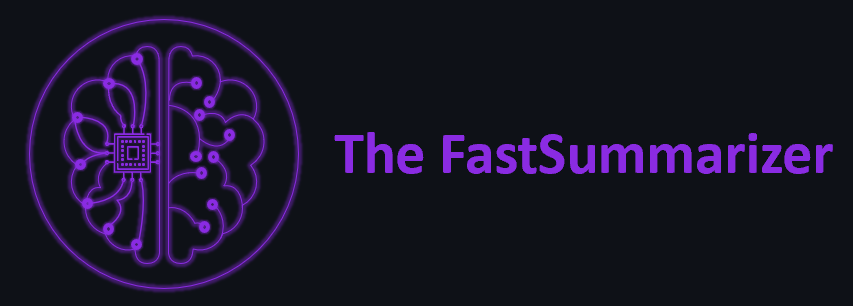

<h1 align="center">Text Summarizer with Streamlit</h1>

<h2 align="center">🤖 Hi welcome to my GitHub repository! I'm The FastSummarizer and I'll show you how to implement a text summarizer on Python with a custom web application on Streamlit</h2>

<p align="center">

</p>

<p align="center">
<a href="https://github.com/lprtk/TextSummarizer/issues"></a>
<a href="https://github.com/lprtk/TextSummarizer/network"></a>
<a href="https://github.com/lprtk/TextSummarizer/stargazers"></a>
<a href="https://github.com/lprtk/TextSummarizer/blob/master/LICENSE"></a>
<a href="https://github.com/lprtk/TextSummarizer/"></a>
</p>


## Table of contents

* [Overview :loudspeaker:](#Overview)
* [Context :mag_right:](#Context)
  * [Text summarization](#Text-summarization)
  * [Web application](#Web-application)
* [Requirements :page_with_curl:](#Requirements)
* [File details :open_file_folder:](#File-details)
* [Quickstart :arrow_forward:](#Quickstart)
* [Demonstration :clapper:](#Demonstration)
* [Contribution :raising_hand:](#Contribution)
* [Features :computer:](#Features)


<a id='section01'></a>

## Overview

<p align="justify">Impact Summarization systems often have additional evidence they can utilize in order to specify the most important topics of document(s). In scientific paper summarization, there is a considerable amount of information such as cited papers and conference information which can be leveraged to identify important sentences in the original paper.</p>


<a id='section02'></a>

## Context

<a id='section02a'></a>

 ### Text summarization

<p align="justify">With our busy schedule, we prefer to read the summary of article on daily news, entertainment, sports before we decide to jump in for reading entire article. Reading a summary help us to identify the interest area, gives a brief context of the story.</p>
> Summarization can be defined as a task of producing a concise and fluent summary while preserving key information and overall meaning.

<p align="center">

</p>

#### How text summarization works

In general, there are two types of summarizations, abstractive and extractive summarization.
* <p align="justify"><strong>Abstractive Summarization</strong>: Abstractive methods select words based on semantic understanding, even those words did not appear in the source documents. It aims at producing important material in a new way. They interpret and examine the text using advanced natural language techniques in order to generate a new shorter text that conveys the most critical information from the original text. It can be correlated to the way human reads a text article or blog post and then summarizes in their own word.</p>
```
Input document → understand context → semantics → create own summary.
```

</br>

* <p align="justify"><strong>Extractive Summarization</strong>: Extractive methods attempt to summarize articles by selecting a subset of words that retain the most important points. This approach weights the important part of sentences and uses the same to form the summary. Different algorithm and techniques are used to define weights for the sentences and further rank them based on importance and similarity among each other.</p>
```
Input document → sentences similarity → weight sentences → select sentences with higher rank.
```

</br>

<p align="justify">There are many techniques available to generate extractive summarization. In this project, to simplify the understanding of the implementation of a text summarizer, we will use the extractive summarization approach. We don’t use an AI model but an <strong>unsupervised learning approach to find the sentences similarity and rank</strong> them. One benefit of this will be, you don’t need to train and build a model prior start using it for your project.</p>
<p align="justify">It’s good to understand <strong>Cosine similarity</strong> to make the best use of code you are going to see. Cosine similarity is a measure of similarity between two non-zero vectors of an inner product space that measures the cosine of the angle between them. Since we will be representing our sentences as the bunch of vectors, we can use it to find the similarity among sentences. Its measures cosine of the angle between vectors. Angle will be <strong>0 if sentences are similar</strong>.</p>

<p align="justify">In addition, it is important to understand that we will use <strong>textrank</strong> as an approach to rank the sentences. TextRank does not rely on any previous training data and can work with any arbitrary piece of text. TextRank is a general purpose graph-based ranking algorithm for NLP.</p>

</br>

Next, Below is our code flow to generate summarize text.
```
Input article → split into sentences → remove stop words → build a similarity matrix → generate rank based on matrix → pick top N sentences for summary.
```

<a id='section02b'></a>

### Web Application

<p align="justify">In order to make the application useful, we decided to implement a <strong>web application</strong> so that it is easily accessible to everyone. When a user wants to use our tool, he must first create an account. Then he can log in and use our text summarization tool as he wishes. Our web application is not only a host for our Python project, there is also a whole issue of managing access to it. We have implemented several features:</p>

* Create an account.
* Logging in and out.
* Change your password.
* Reset your password if you forget it.
* Delete your user account.

</br>

<p align="justify">To do this, it has a whole management of a database in which we store the information of the user but we take care to <strong>encrypt</strong> his password before storing it what allows not to have access directly by opening the database and to <strong>reinforce the security of our application</strong>.</p>

</br>

Below is how we store the passwords of users using our platform.

<p align="center">

</p>


<a id='section03'></a>

## Requirements
* **Python version 3.9.7**

* **Install requirements.txt**
```console
$ pip install -r requirements.txt
```

* **Librairies used**
```python
from hashlib import sha256
from networkx import from_numpy_array, pagerank
import nltk
from nltk.cluster.util import cosine_distance
from nltk.corpus import stopwords
import numpy as np
import pandas as pd
from PIL import Image
from random import choice, shuffle
import streamlit as st
from string import ascii_letters, digits, punctuation
from sqlite3 import connect
```


<a id='section04'></a>

## File details
* **requirements**
  * This folder contains a text file with all the packages and versions needed to run the project.
* **testfile**
  * This folder contains 3 text files to test The FastSummarizer.
* **frontend**: Front end code is in the `src_streamlit` folder.
  * This folder contains file for streamlit web application.
  * UI for FastSummarizer users.
* **backend**: Back End code is in the `src_functionality` folder.
  * This folder contains a file for each task: the database management system, the web application's own functionalities, or the core of the project: the functions for making text summaries...etc
  * Each task has been implemented as a microservice so that they can be maintained and managed independently.

</br>

Here is the project pattern:
```
- project
    > FastSummarizer
        > image
            - logo.png
            - logoAI.png
            - summarizing.png
            - hashing.png
            - use_fastsummarizer.png
            - webapp_functionalities.png
        > testfile
            - fb.txt
            - msft.txt
            - trump.txt
        > requirements
            - requirements.txt
        > frontend
            > src_streamlit
                - app.py
        > backend
            - src_functionality
                - password_generator.py
                - hash_function.py
                - sgbd.py
                - app_function.py
```


<a id='section05'></a>

## Quickstart

### Installation and Setup
* Clone the Repo.
* Import, in the same directory, files from `src_streamlit`, `src_functionality` and logoAI.png from `image` directory.
* Run the **Streamlit app** with the `streamlit run command`.
* Use The FastSummarizer bot.

</br>

1. **Project initialization**
    * Clone the Repo.
    * Make sure that `src_streamlit`, `src_functionality` files and logoAI.png from `image` are stocked in the same directory.
     * When you will launch the app.py file in `src_streamlit` folder, it calls all necessary functions in `src_functionality` folder.

2. **Running front and back end services**
    * Run the **Streamlit app**, and the functionalities in backend, with the `streamlit run command`.
     * Go to the `src_streamlit` folder.
     ```console
     $ cd src_streamlit
     src_streamlit:~$ streamlit run app.py
     ```

3. **Use the FastSummarizer**
    * Create an account.
    * Login you.
    * Upload our text file on the web app.
    * Select the number of sentences you want in your summary.
    * Download your summary.
    * Don't forget to logout you :wink:


<a id='section06'></a>

## Demonstration

* **How use The FastSummarizer? Click on the video below :point_down:**

[](https://www.youtube.com/watch?v=YW8aLyyle1g)

</br>

* **To better understand the functionalities of the application watch the video below :point_down:**

[](https://www.youtube.com/watch?v=zmv2V_6CyCA)


<a id='section07'></a>

## Contribution

This project was realized by [me](https://github.com/lprtk) in the context of an introduction to Git / GitHub course. The instructions were to take a GitHub project already made and to think about improvements and implement them if possible, to make several pushs, commits via Linux and then to make a pull request.

</br>

<p align="justify">I chose the repository of an article of the Towards Data Science media allowing to implement a tool realizing a summary of a text (link of the original GitHub repo and of the article on which this code is based below). I didn’t modify the codes allowing to calculate the similarity between sentences or to create these summaries. On the other hand, I have:</p>

* Improved the quality of the code (docstring, PEP8 nomenclature).
* Implemented a webApp allowing to use the tool easily.
* Implemented a system of rights management / "secure" connection to the application (LogIn, LogOut, forgot password, change password or delete account functionalities).


<a id='section08'></a>
## Features

<p align="center">
  <a href="https://github.com/edubey/text-summarizer">Original GitHub page</a> •
  <a href="https://towardsdatascience.com/understand-text-summarization-and-create-your-own-summarizer-in-python-b26a9f09fc70">Medium article page</a> •
  <a href="https://docs.streamlit.io/library/api-reference">Streamlit docs</a>
</p>

